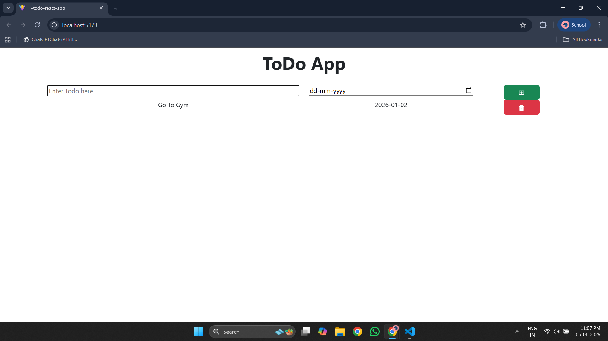
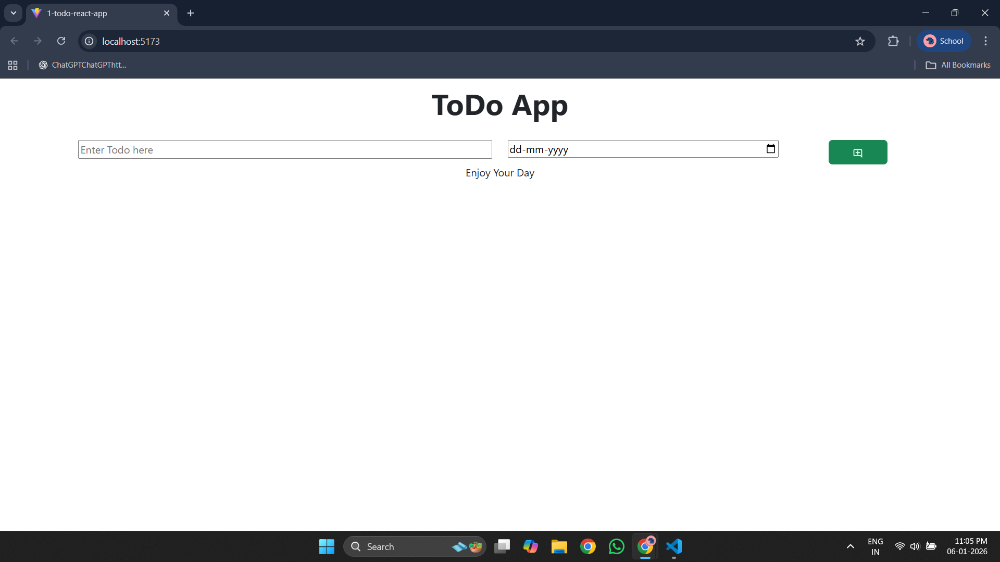

# 📝 Todo Website (React)

A simple, clean, and responsive **Todo Website** built using **React.js**, **JavaScript**, **CSS**, and **Bootstrap**. This project helps users manage their daily tasks efficiently and marks my **first GitHub repository**, showcasing my journey into web development.

---

## 🚀 Features

* ➕ Add new tasks
* ❌ Delete tasks
* 📱 Fully responsive design
* 🎨 Clean and minimal UI

---

## 🛠️ Tech Stack

* **React.js** – Frontend library
* **JavaScript (ES6)** – Logic and functionality
* **HTML5** – Structure
* **CSS3** – Styling
* **Bootstrap** – Responsive design

---

## 📂 Project Structure

```
Todo-Website/
│
├── public/
│   └── index.html
│
├── src/
│   ├── components/
│   ├── App.jsx
│   ├── main.jsx
│   └── index.css
│
└── package.json
```

---

## ⚙️ Installation & Setup

1. Clone the repository
2. Install dependencies using `npm install`
3. Run the project using `npm run dev`

---

## 📸 Screenshots

### Tasks Added


### Tasks Completed


---

## 🔮 Future Improvements

* 💾 Save tasks using Local Storage
* 🌙 Dark mode support
* ✏️ Edit existing tasks
* 🔍 Search and filter tasks
* 📅 Task priority and due dates

---

## 👤 Author

**Anuj Prajapati**
GitHub: [Anuj2556](https://github.com/Anuj2556)

---

⭐ If you like this project, don’t forget to star the repository!
